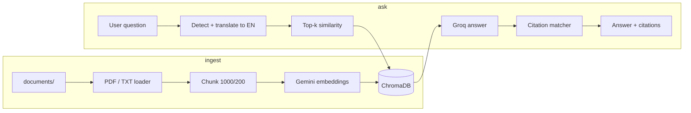

# RefineRAG

Citation-backed document Q&A and two-document contradiction auditing. Built for the Potens intern take-home: answer questions strictly from ingested PDFs/text with traceable sources, and compare policy versions on a topic without cross-contaminating retrieval.

**Stack:** FastAPI, Streamlit, LangChain, ChromaDB, Gemini embeddings, Groq (Llama 3.1) for generation and translation.

**Repo:** https://github.com/Vaidik-Pipaliya/potens-intern-ai-vaidik-pipaliya

---

## How to run

### Prerequisites

- Python 3.10+
- [Google AI API key](https://aistudio.google.com/apikey) (embeddings)
- [Groq API key](https://console.groq.com/) (chat / translation — see *Known gaps*)

### 1. Clone and create a virtual environment

```bash
git clone https://github.com/Vaidik-Pipaliya/potens-intern-ai-vaidik-pipaliya.git
cd potens-intern-ai-vaidik-pipaliya

python -m venv venv
# Windows
venv\Scripts\activate
# macOS / Linux
source venv/bin/activate

pip install -r requirements.txt
```

### 2. Environment variables

Create `.env` in the project root (never commit this file):

```env
GEMINI_API_KEY=your_google_key_here
GROQ_API_KEY=your_groq_key_here

# Optional — defaults to <project_root>/app/database/chroma_db
CHROMA_DB_PATH=
```

### 3. Add documents and build the index

Place `.pdf`, `.txt`, or `.md` files in `documents/` (sample assignment PDF is already included). Then:

```bash
python -m app.rag.ingest
```

Expect log output with chunk count and a successful Gemini embedding call. Re-run after adding or changing files.

### 4. Start the API

```bash
uvicorn app.main:app --reload --port 8000
```

- Root: http://127.0.0.1:8000/
- Swagger: http://127.0.0.1:8000/docs

**Smoke test:**

```bash
curl -X POST http://127.0.0.1:8000/api/ask \
  -H "Content-Type: application/json" \
  -d "{\"question\": \"What is the duration of the internship?\"}"
```

For contradiction checks, ingest two policy files (e.g. `temp_policy_v1.txt` / `temp_policy_v2.txt`) and call `POST /api/contradict` with matching `doc1_id` / `doc2_id` filenames.

### 5. Start the UI (separate terminal)

```bash
streamlit run streamlit_app.py
```

Open http://localhost:8501. The UI can call the API (`API_BASE_URL`) or import the RAG modules directly when the API is not running.

### 6. Run unit tests

```bash
python -m unittest tests.test_refinerag -v
```

Tests mock the LLM and vector store; they do not call live APIs.

---

## Project layout

```
app/
  main.py              # FastAPI app
  api/                 # /api/ask, /api/contradict
  rag/                 # ingest, retrieval, citations, contradiction
  utils/               # language detection, translation
documents/             # source files for ingestion
streamlit_app.py       # demo UI
tests/test_refinerag.py
```

---

## Design decisions

### Why citations are computed after generation, not by the LLM

LLMs routinely invent page numbers and chunk IDs. RefineRAG asks the model only for an answer (with optional `[Piece N]` tags tied to retrieved chunks), then maps sentences to chunks in `citations.py` via normalized substring match or tag index. Metadata (`source`, `page`, `chunk_id`) always comes from Chroma, not from model prose.

### Why retrieval runs in English even for non-English questions

The index is built from English (or mixed) source text. `langdetect` plus an LLM translation step converts the user question to English before `similarity_search`, then translates the final answer back. That trades extra latency for better recall on a single-language index.

### Why contradiction search is filtered per document

A single global search blends versions. `analyze_contradiction` runs two filtered retrievals (`filter={"source": doc_id}`) so each LLM context block comes from one file, then requests strict JSON with verbatim evidence fields.

### Chunking: 1000 / 200 overlap

`RecursiveCharacterTextSplitter` with paragraph-first separators keeps policy clauses intact. Overlap reduces lost stipends/dates at chunk boundaries. `chunk_id` is assigned sequentially at ingest for stable citation references.

### Embeddings vs chat model split

- **Gemini `gemini-embedding-001`** — batch embeddings with simple rate-limit retries (free tier RPM).
- **Groq `llama-3.1-8b-instant`** — Q&A and translation at temperature 0 for cost and speed.

This split was a pragmatic choice when Gemini chat rate limits were tight during development; it does mean two API keys and two vendors in production.

### Ingest clears IDs instead of deleting the Chroma folder

On Windows, deleting the persist directory while Uvicorn holds files causes `WinError 32`. Ingest deletes existing collection IDs via `db.delete()` then `add_documents`, avoiding directory locks.

### Strict “not found” behavior

The QA prompt requires the exact phrase `Not found in the provided documents.` when context is insufficient; `qa_chain.py` normalizes any variant of that refusal and returns zero citations.

---

## Architecture (high level)



---

## API reference

### `POST /api/ask`

```json
{
  "question": "What is the duration of the internship?",
  "language": "Spanish"
}
```

`language` is optional; if omitted, the response language follows detected query language.

### `POST /api/contradict`

```json
{
  "doc1_id": "temp_policy_v1.txt",
  "doc2_id": "temp_policy_v2.txt",
  "topic": "stipend"
}
```

`doc1_id` / `doc2_id` must match the `source` metadata basename stored at ingest time.

---

## Known gaps and unfinished work

| Issue | Impact |
|--------|--------|
| **`langchain-groq` was missing from `requirements.txt`** | Fresh `pip install -r requirements.txt` could fail at import; added in this revision. |
| **README previously said “Gemini LLM”** | Generation/translation actually use **Groq**; embeddings use Gemini. |
| **`confidence` is hardcoded to `0.9`** | Not derived from retrieval scores or model logprobs. |
| **Citation fallback uses top-1 chunk** | If the model paraphrases without `[Piece N]` tags and no substring match, citations may be weakly aligned. |
| **Contradiction JSON parsing** | Malformed LLM JSON returns `contradiction_found: false` with an error string — no retry or schema validator. |
| **LangChain `Chroma` deprecation warning** | Still on `langchain_community.vectorstores`; should migrate to `langchain-chroma`. |
| **No CI, Docker, or auth** | Local dev only; API is open CORS. |
| **`documents/README.md` is skipped at ingest** | Avoids indexing placeholder text as policy content. |
| **Streamlit “API mode” vs “local mode”** | Two code paths; easy to test one and forget the other. |

---

## What I would build next

1. **Single-model or configurable provider** — env flag to use Gemini or Groq for chat so README, code, and ops match.
2. **Real confidence** — combine max similarity score, citation match rate, and refusal detection.
3. **Hybrid retrieval** — BM25 + vectors for rare exact tokens (dates, INR amounts, policy IDs).
4. **Structured contradiction output** — Pydantic + `with_structured_output` instead of regex-stripped JSON.
5. **Ingestion API** — upload + version metadata (`doc_version`, `effective_date`) for audit trails.
6. **Evaluation harness** — golden Q&A set with citation precision/recall metrics (removed ad-hoc scripts to slim the repo; would reintroduce as a maintained `tests/eval/` package).

---

## AI use log

We used AI assistants throughout this project. Approximate usage below; counts are honest estimates, not invoice-grade.

| Tool | Approx. usage | What we used it for |
|------|----------------|---------------------|
| **Cursor (Agent + inline)** | ~40 agent threads / ~500k tokens; ~1,500 inline suggestions | Repo hygiene, venv verification, GitHub push, README rewrite, targeted refactors and comments. |
| **Antigravity (IDE)** | ~180 runs / ~1.2M context tokens | Multi-file RAG implementation, ingestion pipeline, Streamlit UI scaffolding. |
| **Claude (Sonnet / Opus)** | ~150 messages / ~850k input tokens | Citation engine design, contradiction prompt, debugging LangChain + Chroma behavior. |
| **Google Gemini (API + AI Studio)** | ~120 API calls / ~600k tokens | Embeddings, embedding rate-limit handling, multilingual test queries. |
| **GitHub Copilot** | ~8,000 accepted completions | Docstrings, test boilerplate, FastAPI route stubs. |
| **ChatGPT (GPT-4o)** | ~60 chats / ~200k tokens | README structure, API contract wording, take-home requirement mapping. |
| **Groq** | Production inference (not an authoring assistant) | Runtime Llama 3.1 for Q&A and translation via API. |

**Not used:** Bolt, v0, Codex CLI, or other codegen tools for this repository.

**Human work:** Architecture choices (post-hoc citations, filtered contradiction retrieval, English-index multilingual flow), manual test runs against live APIs, and final review of what ships to GitHub.
