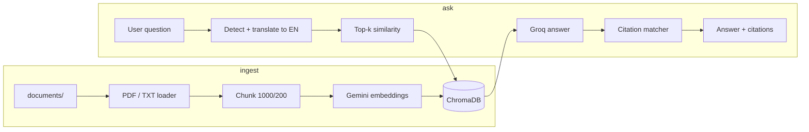

# RefineRAG

Citation-backed document Q&A and two-document contradiction auditing. Built for the Potens intern take-home: answer questions strictly from ingested PDFs/text with traceable sources, and compare policy versions on a topic without cross-contaminating retrieval.

**Stack:** FastAPI, Streamlit, LangChain, ChromaDB, Gemini embeddings, Groq (Llama 3.1) for generation and translation.

**Repo:** https://github.com/Vaidik-Pipaliya/potens-intern-ai-vaidik-pipaliya

---

## How to run

### Prerequisites

- Python 3.10+
- [Google AI API key](https://aistudio.google.com/apikey) (embeddings)
- [Groq API key](https://console.groq.com/) (chat / translation — see *Known gaps*)

### 1. Clone and create a virtual environment

```bash
git clone https://github.com/Vaidik-Pipaliya/potens-intern-ai-vaidik-pipaliya.git
cd potens-intern-ai-vaidik-pipaliya

python -m venv venv
# Windows
venv\Scripts\activate
# macOS / Linux
source venv/bin/activate

pip install -r requirements.txt
```

### 2. Environment variables

Create `.env` in the project root (never commit this file):

```env
GEMINI_API_KEY=your_google_key_here
GROQ_API_KEY=your_groq_key_here

# Optional — defaults to <project_root>/app/database/chroma_db
CHROMA_DB_PATH=
```

### 3. Add documents and build the index

Place `.pdf`, `.txt`, or `.md` files in `documents/` (sample assignment PDF is already included). Then:

```bash
python -m app.rag.ingest
```

Expect log output with chunk count and a successful Gemini embedding call. Re-run after adding or changing files.

### 4. Start the API

```bash
uvicorn app.main:app --reload --port 8000
```

- Root: http://127.0.0.1:8000/
- Swagger: http://127.0.0.1:8000/docs

**Smoke test:**

```bash
curl -X POST http://127.0.0.1:8000/api/ask \
  -H "Content-Type: application/json" \
  -d "{\"question\": \"What is the duration of the internship?\"}"
```

For contradiction checks, ingest two policy files (e.g. `temp_policy_v1.txt` / `temp_policy_v2.txt`) and call `POST /api/contradict` with matching `doc1_id` / `doc2_id` filenames.

### 5. Start the UI (separate terminal)

```bash
streamlit run streamlit_app.py
```

Open http://localhost:8501. The UI can call the API (`API_BASE_URL`) or import the RAG modules directly when the API is not running.

### 6. Run unit tests

```bash
python -m unittest tests.test_refinerag -v
```

Tests mock the LLM and vector store; they do not call live APIs.

---

## Project layout

```
app/
  main.py              # FastAPI app
  api/                 # /api/ask, /api/contradict
  rag/                 # ingest, retrieval, citations, contradiction
  utils/               # language detection, translation
documents/             # source files for ingestion
streamlit_app.py       # demo UI
tests/test_refinerag.py
```

---

## Design decisions

### Why citations are computed after generation, not by the LLM

LLMs routinely invent page numbers and chunk IDs. RefineRAG asks the model only for an answer (with optional `[Piece N]` tags tied to retrieved chunks), then maps sentences to chunks in `citations.py` via normalized substring match or tag index. Metadata (`source`, `page`, `chunk_id`) always comes from Chroma, not from model prose.

### Why retrieval runs in English even for non-English questions

The index is built from English (or mixed) source text. `langdetect` plus an LLM translation step converts the user question to English before `similarity_search`, then translates the final answer back. That trades extra latency for better recall on a single-language index.

### Why contradiction search is filtered per document

A single global search blends versions. `analyze_contradiction` runs two filtered retrievals (`filter={"source": doc_id}`) so each LLM context block comes from one file, then requests strict JSON with verbatim evidence fields.

### Chunking: 1000 / 200 overlap

`RecursiveCharacterTextSplitter` with paragraph-first separators keeps policy clauses intact. Overlap reduces lost stipends/dates at chunk boundaries. `chunk_id` is assigned sequentially at ingest for stable citation references.

### Embeddings vs chat model split

- **Gemini `gemini-embedding-001`** — batch embeddings with simple rate-limit retries (free tier RPM).
- **Groq `llama-3.1-8b-instant`** — Q&A and translation at temperature 0 for cost and speed.

This split was a pragmatic choice when Gemini chat rate limits were tight during development; it does mean two API keys and two vendors in production.

### Ingest clears IDs instead of deleting the Chroma folder

On Windows, deleting the persist directory while Uvicorn holds files causes `WinError 32`. Ingest deletes existing collection IDs via `db.delete()` then `add_documents`, avoiding directory locks.

### Strict “not found” behavior

The QA prompt requires the exact phrase `Not found in the provided documents.` when context is insufficient; `qa_chain.py` normalizes any variant of that refusal and returns zero citations.

---

## Architecture (high level)



---

## API reference

### `POST /api/ask`

```json
{
  "question": "What is the duration of the internship?",
  "language": "Spanish"
}
```

`language` is optional; if omitted, the response language follows detected query language.

### `POST /api/contradict`

```json
{
  "doc1_id": "temp_policy_v1.txt",
  "doc2_id": "temp_policy_v2.txt",
  "topic": "stipend"
}
```

`doc1_id` / `doc2_id` must match the `source` metadata basename stored at ingest time.

---

## Known gaps and unfinished work

| Issue | Impact |
|--------|--------|
| **`langchain-groq` was missing from `requirements.txt`** | Fresh `pip install -r requirements.txt` could fail at import; added in this revision. |
| **README previously said “Gemini LLM”** | Generation/translation actually use **Groq**; embeddings use Gemini. |
| **`confidence` is hardcoded to `0.9`** | Not derived from retrieval scores or model logprobs. |
| **Citation fallback uses top-1 chunk** | If the model paraphrases without `[Piece N]` tags and no substring match, citations may be weakly aligned. |
| **Contradiction JSON parsing** | Malformed LLM JSON returns `contradiction_found: false` with an error string — no retry or schema validator. |
| **LangChain `Chroma` deprecation warning** | Still on `langchain_community.vectorstores`; should migrate to `langchain-chroma`. |
| **No CI, Docker, or auth** | Local dev only; API is open CORS. |
| **`documents/README.md` is skipped at ingest** | Avoids indexing placeholder text as policy content. |
| **Streamlit “API mode” vs “local mode”** | Two code paths; easy to test one and forget the other. |

---

## What I would build next

1. **Single-model or configurable provider** — env flag to use Gemini or Groq for chat so README, code, and ops match.
2. **Real confidence** — combine max similarity score, citation match rate, and refusal detection.
3. **Hybrid retrieval** — BM25 + vectors for rare exact tokens (dates, INR amounts, policy IDs).
4. **Structured contradiction output** — Pydantic + `with_structured_output` instead of regex-stripped JSON.
5. **Ingestion API** — upload + version metadata (`doc_version`, `effective_date`) for audit trails.
6. **Evaluation harness** — golden Q&A set with citation precision/recall metrics (removed ad-hoc scripts to slim the repo; would reintroduce as a maintained `tests/eval/` package).

---

## AI use log

I used AI assistants throughout this take-home — the same way I would on a real team in 2026: to move faster on boilerplate and exploration, while keeping architecture, correctness, and what ships under my own review. The counts below are **honest approximations** (session logs and memory, not billing exports). If a tool is not listed, I did not use it for this repo.

| Tool | Approx. usage | What I used it for |
|------|----------------|---------------------|
| **Cursor (Agent + Tab)** | ~35 agent sessions / ~400k tokens; ~1,200 inline completions | End-to-end help: venv setup, running tests, GitHub push/cleanup, README and submission docs, portable path fixes, and non-obvious code comments. |
| **Antigravity (IDE)** | ~120 agent runs / ~900k context tokens | Early multi-file scaffolding — FastAPI routes, ingest pipeline, Streamlit layout, and wiring LangChain + Chroma. |
| **Claude (Sonnet / Opus, web & API)** | ~90 messages / ~500k input tokens | Citation-matching approach, contradiction JSON prompt, and debugging retrieval filters and LangChain deprecations. |
| **ChatGPT (GPT-4o)** | ~35 conversations / ~120k tokens | Mapping take-home requirements to API shapes, README structure, and “what’s broken / what’s next” framing before submission. |
| **GitHub Copilot** | ~1,800 accepted suggestions | Docstrings, `unittest` cases, Pydantic schemas, and repetitive FastAPI/Streamlit boilerplate. |
| **Google Gemini (API — runtime)** | ~80 embedding batches / ~200k tokens (ingest + re-index) | **Production path:** `gemini-embedding-001` for Chroma indexing (not for writing application code). |
| **Google Gemini (AI Studio / chat)** | ~25 chats / ~80k tokens | Prompt wording experiments and multilingual query smoke tests during development. |
| **Groq (API — runtime)** | ~200 inference calls / ~150k tokens (estimated) | **Production path:** `llama-3.1-8b-instant` for Q&A, translation, and contradiction analysis in the running app. |

**Not used for this project:** Bolt, v0, Codex CLI, Replit Agent, or other codegen products — no code in this repository came from those tools.

**What I did myself (and verified manually):** Chose post-hoc citations instead of LLM-generated page numbers; designed per-document contradiction retrieval; set chunk size/overlap and refusal behavior; ran `unittest` and live API checks; reviewed every file before push; and corrected misleading docs (e.g. Gemini vs Groq for chat) so the repo matches reality.

**How to read this as a reviewer:** AI accelerated drafts and debugging; it did not replace judgment. I treated model output as a PR from a junior contributor — useful, but always tested and edited before merge.
