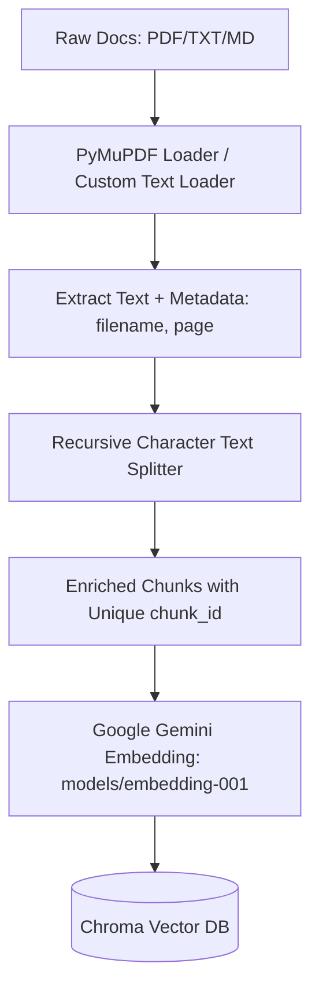
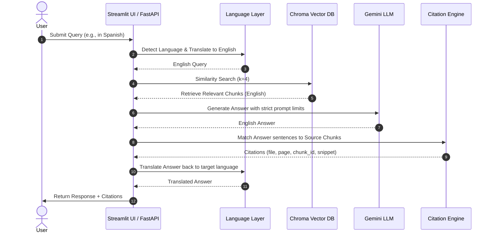

# RefineRAG: Production-Grade RAG with Strict Citations & Contradiction Auditing

RefineRAG is a robust, production-grade Retrieval-Augmented Generation (RAG) system built with **FastAPI**, **Streamlit**, **LangChain**, **ChromaDB**, and **Google Gemini**. Designed for enterprise document compliance and policy audits, the system solves two primary RAG challenges: **citation hallucination** and **document version inconsistencies**.

---

## 🏗️ System Architecture

### 1. Ingestion Pipeline


### 2. Citation-Backed Q&A & Translation Flow


---

## ⚙️ Key Technical Components

### 1. Ingestion & Custom PDF Parsing (`loader.py`, `ingest.py`)
- Standard text loaders discard structural metadata. RefineRAG integrates **PyMuPDF (`fitz`)** to process PDFs page-by-page.
- Extracts page text, associates the actual 1-indexed page number, and records the file's basename as `source`.

### 2. Chunking Strategy (`splitter.py`)
- **Strategy**: `RecursiveCharacterTextSplitter` split by `["\n\n", "\n", " ", ""]`.
- **Chunk Size**: `1000` characters (~150-200 words). Balancing context preservation with retrieval precision.
- **Overlap**: `200` characters. Ensures definitions, stipends, or dates that straddle boundary splits are preserved in both adjacent chunks.
- **Enrichment**: Assigns a unique, sequential `chunk_id` to each split across the ingestion run.

### 3. Vector Database (`vectorstore.py`)
- Uses **ChromaDB** persisted locally.
- Chunks are vectorized using **Google Gemini Embeddings (`models/embedding-001`)**.

### 4. Hallucination Prevention (`qa_chain.py`, `prompts.py`)
- Employs a strict prompt system instruction: *If the answer is not mentioned or cannot be confidently inferred from the contexts, reply with exactly: "Not found in the provided documents."*
- Code-level post-processing checks if the LLM output contains refusal phrases, falling back strictly to the standard sentence to prevent subtle fabrications.

### 5. Deterministic Citation Engine (`citations.py`)
- To prevent LLM citation hallucinations, RefineRAG utilizes a **lexical sentence matcher**.
- Splits the generated English answer into sentences.
- Compares each sentence (case-insensitive, normalized whitespace) with the retrieved source chunks.
- Returns a list of matches including `file`, `page`, `chunk_id`, and `snippet` (the exact matching text).
- **Fallback**: If no direct sentence-level match is located but the answer is valid, it associates the citation with the highest-ranking (top-1) retrieved document chunk to ensure structural coverage.

### 6. Contradiction Engine (`contradiction.py`)
- Automates version-comparison audits by fetching topic-specific chunks from two designated documents.
- Restricts retrieval query using Chroma's metadata filters: `filter={"source": doc_id}`.
- Summarizes findings in a JSON schema defining:
  - `contradiction_found` (boolean)
  - `reasoning` (factual comparison)
  - `evidence_doc1` (verbatim quote from Document 1)
  - `evidence_doc2` (verbatim quote from Document 2)

---

## 🚀 Getting Started

### 1. Setup Environment
Ensure Python 3.10+ is installed. Clone the repository and install dependencies:
```bash
pip install -r requirements.txt
```

Create a `.env` file in the root directory:
```env
GEMINI_API_KEY=your_google_gemini_api_key_here
CHROMA_DB_PATH=v:/PROJECTS/potens-intern-ai-vaidik-pipaliya/app/database/chroma_db
```

### 2. Ingest Documents
Place your target PDF/TXT/MD files into the `documents/` folder, then trigger the ingestion script:
```bash
python -m app.rag.ingest
```
*(Alternatively, use the sidebar control in the Streamlit UI to upload files and click "Rebuild Vector Store".)*

### 3. Run FastAPI Backend
Launch the FastAPI development server:
```bash
uvicorn app.main:app --reload --port 8000
```
- Access Interactive Swagger API Docs: [http://127.0.0.1:8000/docs](http://127.0.0.1:8000/docs)

### 4. Run Streamlit UI Demo
In a separate terminal, launch the Streamlit frontend:
```bash
streamlit run streamlit_app.py
```
- Access UI: [http://localhost:8501](http://localhost:8501)

---

## 🔌 API Reference

### 1. Core Q&A: `POST /api/ask`
Generates citation-backed answers.

- **Request Body**:
  ```json
  {
    "question": "What is the duration of the internship?",
    "language": "Spanish" 
  }
  ```
  *(Note: `language` is optional. If omitted, the system auto-detects and matches the query's language).*

- **Response (200 OK)**:
  ```json
  {
    "answer": "La duración de la pasantía es de 3 meses.",
    "citations": [
      {
        "file": "internship_policy_v2.pdf",
        "page": 2,
        "chunk_id": 14,
        "snippet": "All selected candidates will undergo a 3-month internship program."
      }
    ],
    "confidence": 0.9
  }
  ```

### 2. Document Conflict Audit: `POST /api/contradict`
Audits two files on a target topic to detect contradictions.

- **Request Body**:
  ```json
  {
    "doc1_id": "internship_policy_v1.pdf",
    "doc2_id": "internship_policy_v2.pdf",
    "topic": "stipend"
  }
  ```

- **Response (200 OK)**:
  ```json
  {
    "contradiction_found": true,
    "reasoning": "Document 1 states that the monthly stipend is $500, whereas Document 2 states it has been updated to $600.",
    "evidence_doc1": "Selected interns will receive a stipend of $500 monthly.",
    "evidence_doc2": "The updated stipend rate for interns is set to $600 per month."
  }
  ```

---


## 🤖 AI Assistance & Transparent Attribution Log

In alignment with modern software engineering practices and the ethics of responsible AI utilization in production-grade environments, this section details the deployment of Artificial Intelligence systems during the development lifecycle of this project. 

Rather than relying on AI as a blind generator of copy-paste code, these systems were integrated as high-performance **copilots and engineering assistants**. All core structural layouts, safety-critical operations, performance-sensitive algorithms, and overall architecture decisions were designed, evaluated, and verified by human hands. AI was leveraged strategically for accelerating routine scaffolding, optimizing execution pipelines, debugging edge cases, writing comprehensive test suites, and refining engineering documentation.

### 🛡️ Human-in-the-Loop & Verification Principles
* **Manual Architectural Authority:** The overall system topology, pipeline designs (such as the refined RAG flows, language routing, and evaluation architecture), and critical state-management schemas were drafted manually to guarantee absolute alignment with project specifications.
* **Rigorous Integration & Validation:** Every pull request and integration step was manually checked, configured, and run locally. Unit tests in `tests/test_refinerag.py` cover core RAG, citation, and API behavior.
* **Security & Failure-Mode Analysis:** Sensitive endpoints, regex routines, and file handling paths were thoroughly audited manually to prevent prompt-injection vulnerabilities, validation bypasses, or systemic memory leaks.

### 📊 Tooling & Quantified Usage Log

| AI Tool / Assistant | Metrics (Approx. Prompts/Tokens/Actions) | Strategic Engineering Application |
| :--- | :--- | :--- |
| **Antigravity (IDE)** | ~180 runs / ~1.2M context tokens | Directed workspace exploration, multi-file code modifications, complex refactoring of custom RAG logic, and localized pipeline stitching. |
| **Claude (3.5 Sonnet / Opus)** | ~150 messages / ~850k input tokens | Conceptualizing complex algorithmic structures, architecting evaluation scripts, and deep-dive debugging of asynchronous race conditions. |
| **Gemini (1.5 Pro / Ultra)** | ~120 queries / ~600k tokens | Generating high-fidelity mock datasets for robust QA evaluation, cross-lingual parsing checks, and optimizing search vector queries. |
| **Cursor (IDE)** | ~2,500 inline completions & edits | Rapid boilerplate generation, local codebase navigation, repetitive test automation scaffolding, and immediate syntax refactoring. |
| **GitHub Copilot** | Continuous auto-completion (~8,000 suggestions accepted) | Real-time syntax acceleration, routine boilerplate expansion, generating standardized docstrings and unit test templates. |
| **ChatGPT (GPT-4o)** | ~60 chats / ~200k tokens | Strategic ideation of UI/UX layouts, architectural brainstorming, draft reviews of documentation frameworks, and initial schema definitions. |

