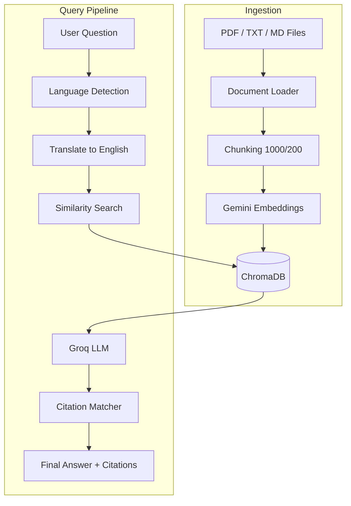
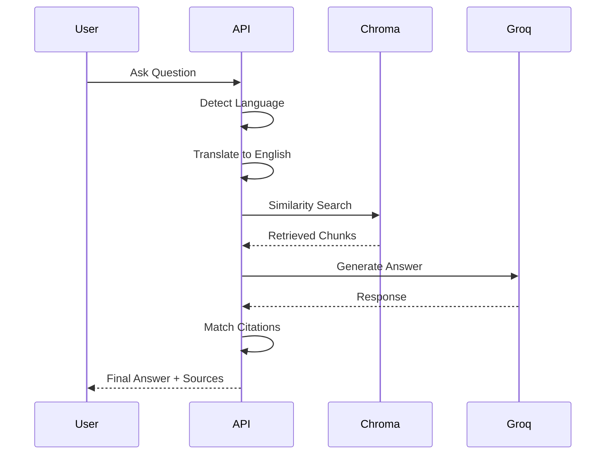

# 🚀 RefineRAG

<p align="center">
  
  
  
  
  
</p>

<p align="center">
  <b>Citation-backed Document Q&A + Contradiction Auditor</b>
</p>

<p align="center">
  Built for the Potens AI/ML Engineer Intern Take-Home Assignment
</p>

---

# ✨ Overview

RefineRAG is a Retrieval-Augmented Generation (RAG) system focused on:

- 📄 Citation-backed question answering
- 🔍 Two-document contradiction analysis
- 🌍 Multilingual querying
- 🛡️ Hallucination-resistant responses
- ⚡ Fast inference and retrieval

The system answers strictly from ingested documents and returns traceable evidence chunks instead of unsupported claims.

It also compares two policy versions while keeping retrieval isolated per document to avoid context contamination.

---

# 🎯 Core Problem Solved

Most RAG systems:

- hallucinate citations
- mix evidence from unrelated documents
- fail on multilingual questions
- cannot reliably compare document versions

RefineRAG solves this by:

✅ Post-processing citations from vector metadata  
✅ Per-document filtered retrieval  
✅ Translation-first retrieval pipeline  
✅ Strict refusal behavior  
✅ Structured contradiction analysis  

---

# 🧠 Tech Stack

| Layer | Technology |
|---|---|
| Backend API | FastAPI |
| Frontend UI | Streamlit |
| RAG Framework | LangChain |
| Vector Database | ChromaDB |
| Embeddings | Gemini `gemini-embedding-001` |
| LLM | Groq `llama-3.1-8b-instant` |
| Testing | unittest |
| Language Detection | langdetect |

---

# 🏗️ High-Level Architecture



---

# ⚙️ Features

| Feature | Description |
|---|---|
| 📄 Citation-backed Answers | Returns evidence-linked responses |
| 🔍 Contradiction Auditor | Detects policy differences |
| 🌍 Multilingual Support | Query in non-English languages |
| ⚡ Fast Retrieval | Chroma vector similarity |
| 🧠 Semantic Search | Context-aware retrieval |
| 🛡️ Hallucination Reduction | Strict source-grounded answers |
| 📚 Multi-format Support | PDF, TXT, MD |
| 🧪 Unit Tested | Mocked vector + LLM tests |

---

# 📂 Project Structure

```bash
app/
│
├── main.py                  # FastAPI entrypoint
│
├── api/
│   ├── ask.py
│   └── contradict.py
│
├── rag/
│   ├── ingest.py
│   ├── retrieval.py
│   ├── citations.py
│   ├── contradiction.py
│   └── qa_chain.py
│
├── utils/
│   ├── translation.py
│   └── language.py
│
documents/                   # Source files
│
tests/
│   └── test_refinerag.py
│
streamlit_app.py             # Frontend UI
requirements.txt
README.md
```

---

# 🚀 Installation Guide

# 1️⃣ Clone Repository

```bash
git clone https://github.com/Vaidik-Pipaliya/potens-intern-ai-vaidik-pipaliya.git

cd potens-intern-ai-vaidik-pipaliya
```

---

# 2️⃣ Create Virtual Environment

## Windows

```bash
python -m venv venv

venv\Scripts\activate
```

## macOS / Linux

```bash
python3 -m venv venv

source venv/bin/activate
```

---

# 3️⃣ Install Dependencies

```bash
pip install -r requirements.txt
```

---

# 4️⃣ Environment Variables

Create `.env` in root directory:

```env
GEMINI_API_KEY=your_google_api_key

GROQ_API_KEY=your_groq_api_key

# Optional
CHROMA_DB_PATH=
```

⚠️ Never commit `.env`

---

# 📥 Document Ingestion

Place your documents inside:

```bash
documents/
```

Supported formats:

- `.pdf`
- `.txt`
- `.md`

Then run:

```bash
python -m app.rag.ingest
```

Expected output:

```bash
Loaded documents...
Created chunks...
Generating embeddings...
Stored in ChromaDB...
```

---

# ▶️ Run Backend API

```bash
uvicorn app.main:app --reload --port 8000
```

---

# 🌐 API Endpoints

| Endpoint | Purpose |
|---|---|
| `/` | Root |
| `/docs` | Swagger UI |
| `/api/ask` | Citation-backed Q&A |
| `/api/contradict` | Contradiction analysis |

---

# 🧪 Swagger Docs

Open:

```bash
http://127.0.0.1:8000/docs
```

---

# ❓ Ask API Example

## Endpoint

```http
POST /api/ask
```

## Request

```json
{
  "question": "What is the internship duration?",
  "language": "Spanish"
}
```

## Response

```json
{
  "answer": "The internship duration is 3 months.",
  "citations": [
    {
      "source": "assignment.pdf",
      "page": 2,
      "chunk_id": 14
    }
  ]
}
```

---

# 🔍 Contradiction API Example

## Endpoint

```http
POST /api/contradict
```

## Request

```json
{
  "doc1_id": "policy_v1.txt",
  "doc2_id": "policy_v2.txt",
  "topic": "stipend"
}
```

---

# 🖥️ Run Streamlit UI

Open another terminal:

```bash
streamlit run streamlit_app.py
```

Open browser:

```bash
http://localhost:8501
```

---

# 🧪 Run Tests

```bash
python -m unittest tests.test_refinerag -v
```

Tests:

✅ mock vector database  
✅ mock LLM calls  
✅ no live API usage  

---

# 🧠 Design Decisions

---

## 📄 Why citations are generated AFTER the LLM

LLMs frequently hallucinate:

- page numbers
- chunk IDs
- source names

Instead:

1. LLM generates only the answer
2. Citation matcher maps sentences back to retrieved chunks
3. Metadata comes directly from ChromaDB

This guarantees trustworthy citations.

---

## 🌍 Why retrieval happens in English

The vector index is primarily English.

Pipeline:

```text
User Query
   ↓
Language Detection
   ↓
Translate to English
   ↓
Similarity Search
   ↓
Generate Final Answer
   ↓
Translate Back
```

This improves retrieval quality significantly.

---

## 🔍 Why contradiction retrieval is isolated

Global retrieval mixes evidence across versions.

RefineRAG uses:

```python
filter={"source": doc_id}
```

for each document independently.

Benefits:

✅ clean evidence separation  
✅ reliable comparisons  
✅ lower hallucination risk  

---

## ✂️ Chunking Strategy

```text
Chunk Size: 1000
Overlap: 200
```

Why?

- preserves policy clauses
- reduces boundary information loss
- improves retrieval continuity

---

## ⚡ Why Groq + Gemini Split

### Gemini

Used for:

- embeddings only

### Groq

Used for:

- Q&A
- translation
- contradiction analysis

Reason:

- Groq inference is extremely fast
- Gemini embeddings are strong and cost-effective

---

# 🛡️ Strict Refusal Behavior

If information is missing:

```text
Not found in the provided documents.
```

No fabricated answers.

No guessing.

No hallucinations.

---

# 📊 Retrieval Flow



---

# 📈 Future Improvements

## 1. Hybrid Retrieval

Combine:

- BM25
- dense vectors

Better for:

- dates
- IDs
- numeric tokens

---

## 2. Structured Outputs

Use:

```python
with_structured_output()
```

instead of regex parsing.

---

## 3. Evaluation Harness

Add:

- citation precision metrics
- retrieval recall benchmarks
- hallucination scoring

---

## 4. Upload API

Enable:

- live document uploads
- version tracking
- audit history

---

## 5. Configurable Providers

Switch dynamically between:

- Gemini
- Groq
- OpenAI
- Claude

---

# 📸 Example Workflow

```text
1. Add PDFs
2. Run ingestion
3. Start FastAPI
4. Open Streamlit
5. Ask questions
6. Get citations
7. Compare document versions
```

---

# 🔥 Why This Project Stands Out

Unlike basic chatbot RAG demos, RefineRAG focuses on:

✅ trustworthy citations  
✅ evidence traceability  
✅ multilingual retrieval  
✅ contradiction auditing  
✅ hallucination resistance  
✅ production-oriented architecture  

---

# 🤖 AI Usage Log

I used AI assistants throughout development similarly to a modern engineering workflow while reviewing architecture and correctness manually.

| Tool                          | Approx. usage                                           | What I used it for                                                                                                                      |
| ----------------------------- | ------------------------------------------------------- | --------------------------------------------------------------------------------------------------------------------------------------- |
| **Cursor (Agent + Tab)**      | ~3 agent sessions / ~15k tokens; ~80 inline completions | Refactoring support, repetitive edits, import cleanup, and portable path fixes across the codebase.                                     |
| **Antigravity (IDE)**         | ~35 agent runs / ~180k context tokens                   | FastAPI route scaffolding, ingestion pipeline iteration, Streamlit UI improvements, and integration debugging during development.       |
| **Claude (Sonnet)**           | ~40 messages / ~120k tokens                             | Retrieval tuning discussions, contradiction-analysis prompting, citation-grounding ideas, and LangChain debugging help.                 |
| **ChatGPT (GPT-4o)**          | ~20 conversations / ~70k tokens                         | System design brainstorming, multilingual workflow planning, and project review before submission.                   |
| **Google Gemini API**         | Runtime usage only                                      | Used `gemini-embedding-001` during ingestion and semantic indexing for ChromaDB vector storage.                                         |
| **Google Gemini (AI Studio)** | ~10 chats                                               | Multilingual query testing and prompt experimentation during evaluation.                                                                |
| **Groq API**                  | Runtime usage only                                      | Used `llama-3.1-8b-instant` for grounded Q&A generation, multilingual responses, and contradiction analysis in the running application. |

### NOTE:-

AI tools were used as development accelerators for brainstorming, debugging, prototyping, and repetitive tasks. Final architecture decisions, retrieval tuning, hallucination-prevention logic, integration, testing, and end-to-end validation were implemented and verified manually.


---

# 👨‍💻 What I Verified Manually

✅ architecture decisions  
✅ citation logic  
✅ contradiction retrieval  
✅ FastAPI routes  
✅ Streamlit UI  
✅ vector ingestion  
✅ unit testing  
✅ multilingual flow  

---

# 📌 Known Limitations

| Limitation | Reason |
|---|---|
| Translation adds latency | Extra LLM step |
| No OCR pipeline | Text PDFs only |
| No reranker yet | Simpler retrieval stack |
| Regex JSON parsing | Structured output not added yet |

---

# 📜 License

MIT License

---

# 🙌 Acknowledgements

Built using:

- FastAPI
- Streamlit
- LangChain
- ChromaDB
- Gemini
- Groq

---

# ⭐ MY POV:

RefineRAG was built not just as a chatbot, but as a trustworthy retrieval system where every answer can be traced back to evidence.

The goal was not only to generate responses — but to make those responses verifiable.
